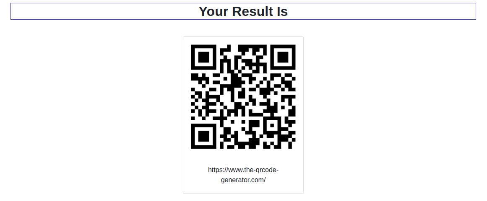

# QR Code Reader Using Django and pyzbar




## Installation

```bash
sudo apt-get install libzbar0
pip install django
pip install pyzbar
pip install opencv-contrib-python
```

## Usage

```python
python manage.py runserver
```
```bash
console window will show the url
```

